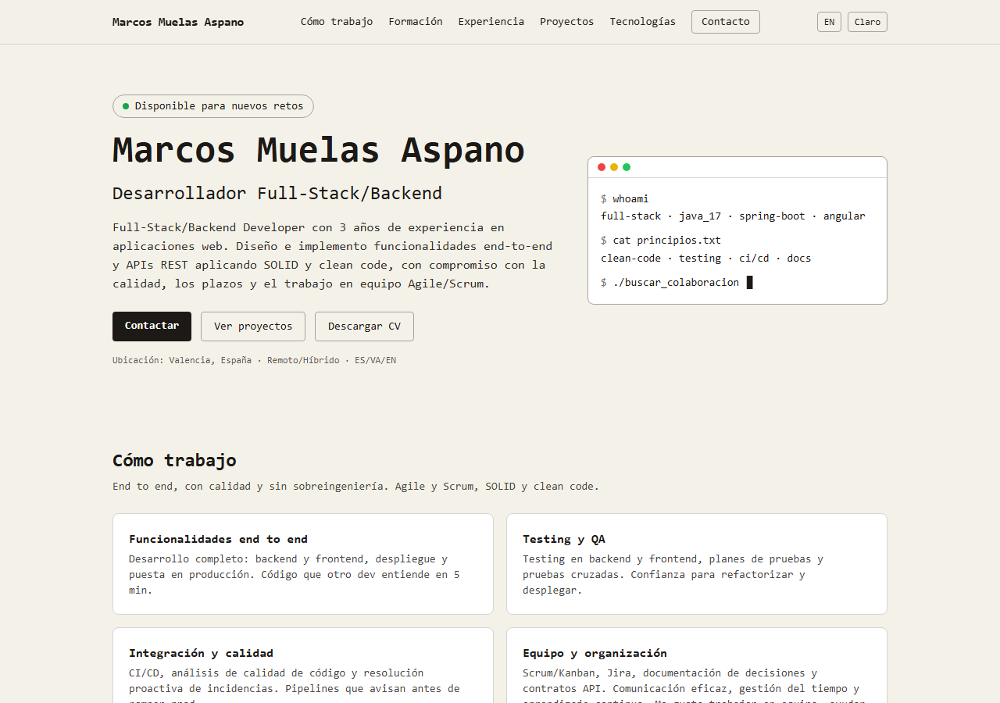

# Marcos Muelas Aspano — Portfolio

Desarrollador Full-Stack/Backend (Java + Angular) · Valencia, España. Portfolio personal con mi experiencia, proyectos y tecnologías.

🌐 **Demo en vivo:** https://marcosmueasp.github.io/marcos-muelas-aspano-portfolio/ · English version: `/en.html`



## Qué contiene

- Cómo trabajo · Formación e idiomas · Experiencia · Proyectos personales (con estado) · Tecnologías con logos oficiales · Contacto
- Español e inglés, modo claro/oscuro con memoria, diseño responsive

## Stack

HTML5 + Tailwind CSS (CLI) + JavaScript vanilla. Sin frameworks: CSS compilado de ~13KB, iconos oficiales locales (Simple Icons, Devicon), 100% estático para GitHub Pages.

## Decisiones técnicas

- **Ultraligera sin frameworks:** una landing no necesita React; HTML + Tailwind purgado carga al instante.
- **Bilingüe con dos HTML estáticos** (`index.html`/`en.html`) en vez de i18n con JS: más simple y mejor SEO.
- **Contacto anti-spam:** sin email en el código (botón que lo monta al pulsar) ni backend; LinkedIn/GitHub/CV como vías directas.

## Uso local

```powershell
npm install
npm run build   # genera dist/output.css minificado
npm run dev     # watch mientras editas HTML
npx serve .     # ver en http://localhost:3000
```

Despliegue: Settings → Pages → Deploy from branch → `main` / root.

## Personalizar

1. El email no va en el repo por seguridad (botón de correo fragmentado en el HTML).
2. CV descargable en `assets/CV_Marcos.pdf`.
3. Rebuild tras cambios: `npm run build` y commit de `dist/output.css`.

## Contacto profesional

- LinkedIn: https://www.linkedin.com/in/marcos-muelas-aspano/
- GitHub: https://github.com/marcosmueasp
